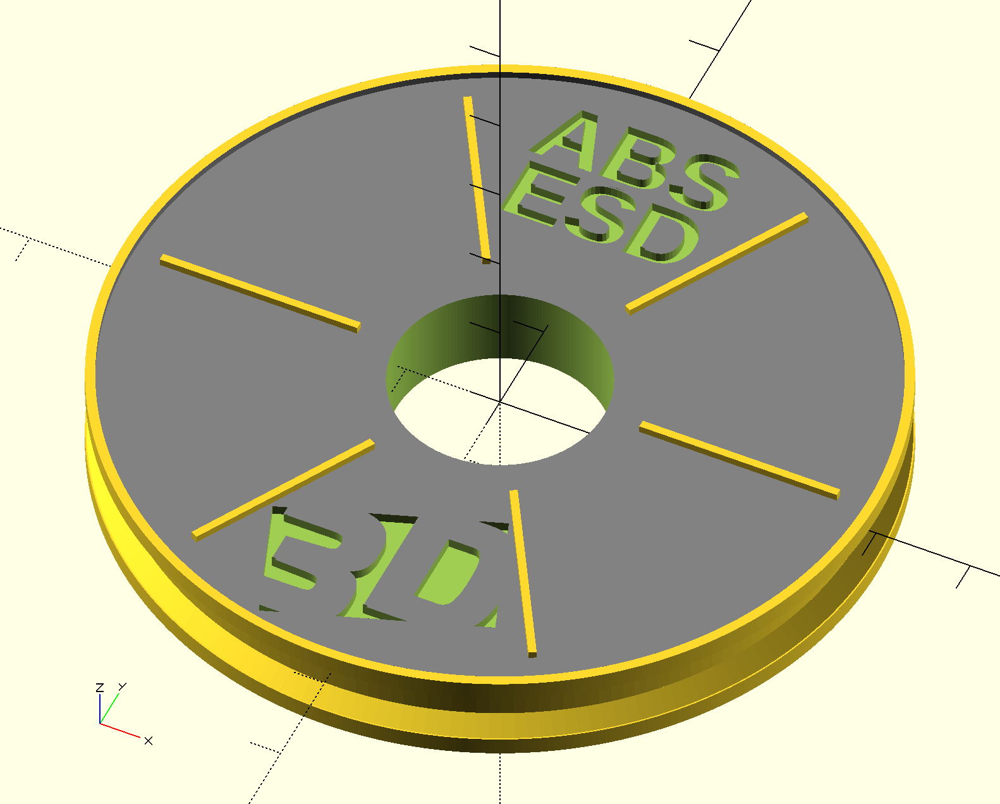

# 3D Expo Filament Reels

A small model of a filament reel with a small logo.
For 3D Expo Prague 2016/05.



- multiple reels can be created from a single template and a table (CSV file) with descriptions
- generating from template and conversion to STL and PNG (thumbnails) is automated

## Description of the model

- it is a small stylized fillament reel to show tangible examples of various materials
- each reel has material description (eg. ABS, PVA) & logo
- the reel consists of a few parts:
  - main cylinder
  - two rim cylinders
  - the upper side is beveled a bit and contains six ribs
  - description & logo - inscribed
  - the inner hole
- the bottom side side flat (it's not seen) so that the models stick well on the printing bed
- the description is parameterized

## Usage of the template in SCAD

```
use <reel.scad>;
reel(["ABS", "ESD"], 18, 0.7);
```

## How to obtain STL?

### Manually - nice for debugging

Open in OpenSCAD, render, export to STL.

### Automation - more practical

- `reel.scad` - template
- `reel_texts.csv` - table of descriptions (+ text size and relative Y position)

Generate reel instances from the template.

```shell
$ python generate_reels_with_text.py
```

Optionally generate previews to PNG. Useful to quickly fix the texts.

```shell
$ ./png_previews.sh
```

Generate STL files from the SCAD files. Each reel instance takes ~ 1:15 min on a MacBook Pro.

```shell
$ ./reels_to_stl.sh
```

The output goes to subdirectories `reels_scad`, `stl`, `png`.

## Logo

The source for the logo is the SVG file.

Since OpenSCAD can only import DXF, we had to export SVG to DXF. For this we can
use Inkscape + a [plugin for export to DXF](https://github.com/brad/Inkscape-OpenSCAD-DXF-Export).

Then it is extruded - see [DXF_Extrusion](https://en.wikibooks.org/wiki/OpenSCAD_User_Manual/DXF_Extrusion) for details.
